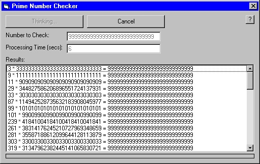



## LARGE Prime Number Checker

### Description

LARGE Prime Number Checker. Largest Possible Number = 9999999999999999999999999999 (Much larger than other prime number checkers). Its fairly quick for a number <= 15 digits long. Equiped with progressbar, seconds of processing time, and currently thinking of information.
 
### More Info
 
Knows that Variants can use CDec(Expression) to deal with larger numbers.

The largest Variant can be:

+/-79,228,162,514,264,337,593,543,950,335 or

+/-7.9228162514264337593543950335

A little error checking...

No "side effects" that I know of... besides waiting alittle on the larger numbers!

             |
---                |---
**Submitted On**   |2001-07-20 23:24:32
**By**             |[David N](https://github.com/Planet-Source-Code/PSCIndex/blob/master/ByAuthor/david-n.md)
**Level**          |Intermediate
**User Rating**    |4.5 (18 globes from 4 users)
**Compatibility**  |VB 5\.0
**Category**       |[Math/ Dates](https://github.com/Planet-Source-Code/PSCIndex/blob/master/ByCategory/math-dates__1-37.md)
**World**          |[Visual Basic](https://github.com/Planet-Source-Code/PSCIndex/blob/master/ByWorld/visual-basic.md)
**Archive File**   |[LARGE Prim231827202001\.zip](https://github.com/Planet-Source-Code/david-n-large-prime-number-checker__1-25277/archive/master.zip)

